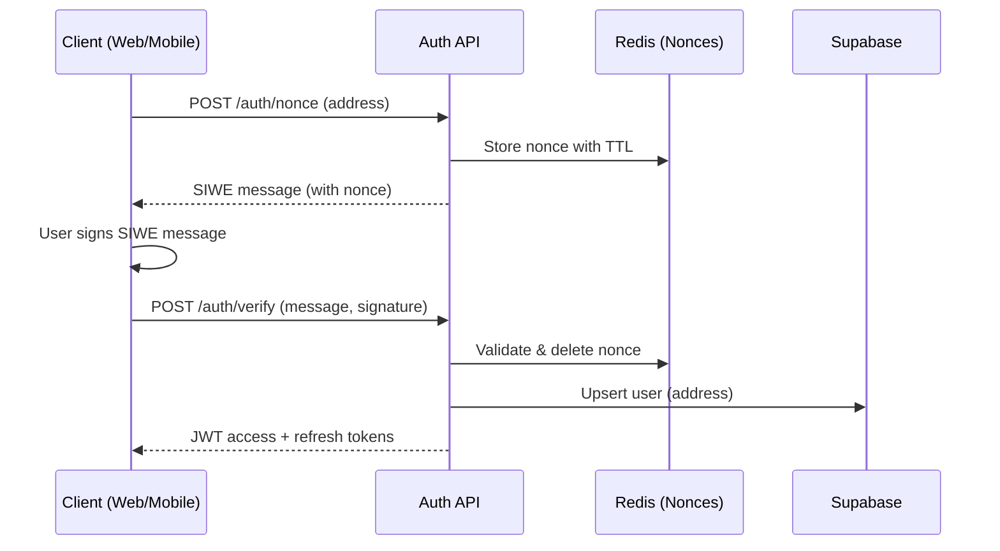
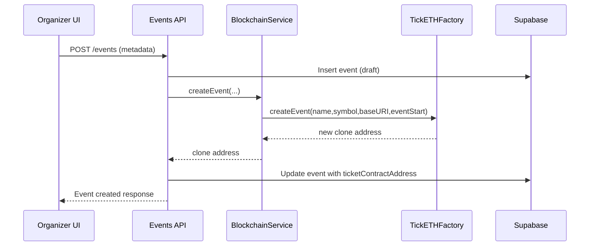
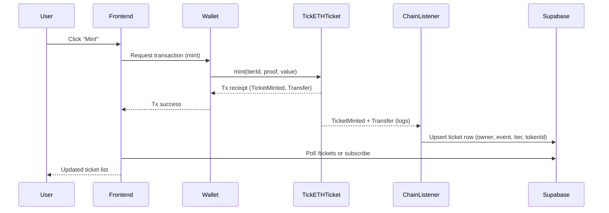

# TickETH System Overview

This document provides a deep technical, logical, and architectural description of the TickETH platform across backend, frontend, mobile, smart contracts, and infrastructure. It is written for engineers who will extend or operate the system.

---

## 1. High-Level Architecture

### 1.1 Purpose & Scope

TickETH is an end-to-end, on-chain ticketing platform. Core goals:

- Trust-minimized ticket issuance and resale using NFTs on Polygon.
- Fair, controlled secondary market with per-tier price and resale caps.
- Robust event check-in with on-chain verification and off-chain reconciliation.
- Multi-channel access: web app (Next.js), mobile app (Expo/React Native), and backend API (NestJS) backed by Supabase and Redis.

### 1.2 Component Map

```mermaid
flowchart LR
  subgraph Clients
    W[Next.js Frontend (web)]
    M[Expo Mobile App]
  end

  subgraph Backend[NestJS Backend API]
    A[Auth Module<br/>SIWE + JWT]
    E[Events Module]
    T[Tickets Module]
    TT[Ticket Tiers Module]
    MP[Marketplace Module]
    Ck[Check-in Module]
    OR[Organizer Requests]
    Spt[Support Module]
    Au[Audit Module]
    Q[Queues / BullMQ]
    BC[Blockchain Module<br/>+ Chain Listener]
    IPFS[IPFS Module]
  end

  subgraph Infra[Infrastructure]
    DB[(Supabase / PostgreSQL)]
    R[(Redis)]
    Qr[(BullMQ Workers)]
  end

  subgraph Chain[Blockchain Layer]
    F[TickETHFactory]
    TK[TickETHTicket (per event)]
    MC[TickETHMarketplace]
  end

  W -->|HTTPS/REST + WS| Backend
  M -->|HTTPS/REST + WS| Backend

  Backend -->|SQL over HTTP| DB
  Backend -->|Pub/Sub + Jobs| R
  Backend -->|queue jobs| Qr

  BC -->|JSON-RPC (ethers)| Chain

  TK -->|Events| BC
  MC -->|Events| BC

  Backend -->|IPFS HTTP| IPFS
```

Key interactions:

- Clients talk only to the backend, **never directly** to Supabase or Redis.
- Smart contracts are accessed via `ethers` and the blockchain module; the chain listener service streams events back into Supabase.
- BullMQ workers perform async work (notifications, audit persistence, reconciliation).

---

## 2. Domain Modules & Responsibilities

### 2.1 Backend (NestJS 11)

Backend root: `backend/src`.

- **AppModule**: wires up all feature modules, global pipes (validation), interceptors, logging, CORS, Swagger, and API prefix `/api/v1`.
- **Auth Module (`auth/`)**
  - SIWE (Sign-In With Ethereum) nonce issuance and verification.
  - Wallet-based login → JWT issuance (access 7d, refresh 30d).
  - `JwtStrategy` guards protected routes via `@UseGuards(AuthGuard('jwt'))`.
  - Stores SIWE nonces in Redis with TTL to prevent replay.
- **Users Module (`users/`)**
  - User profile (display name, avatar, metadata).
  - Link between on-chain address and internal user ID.
- **Events Module (`events/`)**
  - CRUD for events (name, description, venue, times, organizer linkage).
  - Associates events with deployed `TickETHTicket` clones.
  - Provides search/filter endpoints for the frontend and mobile.
- **Ticket Tiers Module (`ticket-tiers/`)**
  - Off-chain representation of on-chain tiers (name, price, max supply, time window, per-wallet caps, whitelist roots, resale caps).
  - Syncs tier changes into on-chain `addTier` and tier status updates.
- **Tickets Module (`tickets/`)**
  - Logical view of each NFT ticket (tokenId, owner address, event, tier, resale count, check-in status).
  - Endpoints for listing a user's tickets, viewing metadata, generating QR payloads, etc.
- **Marketplace Module (`marketplace/`)**
  - Off-chain representation of listings from `TickETHMarketplace`.
  - Read API for active listings, price history, and per-ticket resale stats.
  - Coordinates listing/transaction flows with the contracts.
- **Check-in Module (`checkin/`)**
  - WebSocket-based real-time check-in sessions for events.
  - Backend verifies QR payloads, checks DB + chain state, calls on-chain `checkIn`, and broadcasts status updates.
- **Organizer Requests Module (`organizer-requests/`)**
  - Handles requests to become an organizer (KYC/approval flow).
  - Implements optimistic locking to avoid double approvals.
- **Support Module (`support/`)**
  - Support ticketing system (issue type, status, conversation threads).
  - Used by web and mobile for help/FAQ/issue reporting.
- **Audit Module (`audit/`)**
  - Centralized audit logging for sensitive operations (auth, mint, resale, check-in, admin actions).
  - Uses retry with exponential backoff to avoid impacting main flows.
- **IPFS Module (`ipfs/`)**
  - Uploads event and ticket metadata to IPFS with timeouts and retries.
  - Returns IPFS URIs used as baseURIs for `TickETHTicket`.
- **Blockchain Module (`blockchain/`)**
  - `BlockchainService`:
    - Configures `ethers.JsonRpcProvider` based on `CHAIN_ID` and RPC envs.
    - Injects a signer from `DEPLOYER_PRIVATE_KEY` for writes.
    - Wraps the `TickETHFactory` contract to create events (clones), predict addresses, and verify deployment state.
  - `ChainListenerService`:
    - Long-polling or log-scanning for events from `TickETHTicket` and `TickETHMarketplace`:
      - `Transfer`, `TicketMinted`, `CheckedIn`, `TicketListed`, `TicketSold`, `ListingCancelled`.
    - Maintains `lastProcessedBlock` and an adaptive polling loop with backoff.
    - Reconciles events into Supabase tables for tickets, listings, and check-ins.
- **Queues Module (`queues/`)**
  - BullMQ queues (backed by Redis) for:
    - Notification delivery (email/push/WS fan-out).
    - Heavy reconciliation tasks (e.g., reindexing an event's tickets).
- **Common Module (`common/`)**
  - Shared NestJS guards, decorators, pipes, enums (e.g., `AuditAction`, `ListingStatus`).
  - Supabase service wrapper (`SupabaseService`) centralizing DB access.

### 2.2 Smart Contracts (Hardhat + Solidity 0.8.24)

Contracts live under `contracts/contracts/`.

#### 2.2.1 `TickETHFactory` (Factory)

- Ownable factory that deploys minimal proxy (EIP-1167) clones of `TickETHTicket`.
- Stores:
  - `implementation`: address of the base `TickETHTicket` logic contract.
  - `platformFeeBps`: platform fee in basis points (max 10%).
  - `platformTreasury`: fee recipient.
  - `deployedEvents`: array of all event contract addresses.
  - `organizerEvents`: mapping organizer → their events.
  - `isDeployedEvent`: quick lookup.
- Core functions:
  - `createEvent(name, symbol, baseURI, eventStartTime)`
    - Clones implementation, initializes it with organizer, platform fee, treasury, and event start.
    - Emits `EventContractDeployed`.
  - `createEventDeterministic(...)` with CREATE2 for precomputable addresses.
  - View helpers: `getDeployedEventsCount`, `getOrganizerEvents`, `predictDeterministicAddress`.

#### 2.2.2 `TickETHTicket` (Per-Event Ticket NFT)

- Upgradeable ERC-721, deployed as clones via the factory.
- Key features:
  - Multi-tier ticketing (`Tier` struct) with price, max supply, time windows, per-wallet mint caps, Merkle whitelist, resale limits, and price deviation caps.
  - On-chain check-in per token (`checkIn` and batch variants).
  - Metadata locking and base URI updates.
  - Transfer restriction toggle (only allowed marketplace/escrow flows if enabled).
  - Platform fee split on mint, sent to `platformTreasury`.
- Important mappings:
  - `tiers[tierId]` → on-chain tier config.
  - `tokenTier[tokenId]` → tier membership.
  - `checkedIn[tokenId]` → check-in flag.
  - `walletTierMints[wallet][tierId]` → per-wallet mint counts.
  - `resaleCount[tokenId]` and `originalMintPrice[tokenId]` for resale enforcement.
- Notable functions:
  - `initialize(...)` only callable once; sets core config.
  - `addTier(...)`, `setTierStatus`, `setTierMerkleRoot` for tier management.
  - `mint(tierId, proof)` validates time windows, wallet caps, whitelist, and collects payment.
  - `checkIn(tokenId)` marks on-chain attendance and emits event.
  - `setApprovedMarketplace(address)` whitelists the marketplace.
  - `getResaleInfo(tokenId)` exposes resale constraints to `TickETHMarketplace`.
  - `withdraw()` lets the organizer collect revenue.

#### 2.2.3 `TickETHMarketplace` (Secondary Market)

- Escrow-based marketplace for resale of `TickETHTicket` NFTs.
- Stores:
  - `Listing` struct with seller, ticket contract, tokenId, asking price, original price snapshot, listedAt, active flag.
  - `_activeListingId[ticketContract][tokenId]` to enforce one active listing per ticket.
  - `allowedContracts[ticketContract]` to restrict which tickets can be listed.
- Key functions:
  - `setAllowedContract(ticketContract, allowed)` for admin whitelisting.
  - `listTicket(ticketContract, tokenId, askingPrice)`:
    - Checks owner, approvals, resale caps, and price deviation vs original mint price.
    - Transfers NFT to escrow and records listing.
  - `buyTicket(listingId)`:
    - Splits payment between seller and platform (using `platformFeeBps` and `platformTreasury` from ticket contract).
    - Increments ticket resale count via `incrementResaleCount` on the ticket contract.
    - Transfers NFT to buyer.
  - `cancelListing(listingId)` returns NFT to seller.

### 2.3 Database (Supabase / PostgreSQL)

SQL migrations are under `database/migrations/`. Key tables (high-level):

- `users` — user profiles keyed by wallet address / internal UUID.
- `events` — event metadata and organizer linkage.
- `ticket_tiers` — mirrors on-chain tier configuration.
- `tickets` — one row per tokenId per event.
- `marketplace_listings` — mirrored from `TickETHMarketplace` events.
- `organizer_requests` — state machine for organizer approval.
- `support_tickets` and `support_messages` — basic support/help system.
- `audit_logs` — append-only log of sensitive operations.

The backend uses a `SupabaseService` wrapper to centralize queries and error handling.

### 2.4 Redis + BullMQ

Redis is used for:

- SIWE nonce storage with TTL.
- BullMQ queue backing for asynchronous tasks.

BullMQ queues handle:

- Email/push notifications on successful mint, resale, support updates.
- Long-running reconciliation (e.g., replaying chain logs from a given block).

### 2.5 Frontend (Next.js 16 App Router)

Frontend root: `frontend/`.

- Next.js 16 using App Router (`src/app/`) for pages.
- Tailwind CSS 4 for styling.
- State management via Zustand for global app state (auth, wallet connection, filters).
- Thirdweb SDK for wallet connection and contract interactions.
- Sonner for toast notifications; Framer Motion + Three.js for UI polish.

Typical flows:

- **Landing & discovery**: list events with filtering; event detail pages show tiers and pricing.
- **Connect wallet**: uses thirdweb to connect MetaMask or similar provider.
- **Sign-in**: triggers SIWE request against backend, receives nonce, signs it, and exchanges for JWT.
- **Mint tickets**: orchestrates transaction via thirdweb or an injected signer and calls backend APIs for off-chain persistence.
- **View & manage tickets**: pages to view owned tickets, show QR codes, link to marketplace listings, etc.
- **Marketplace UI**: listing creation, browsing, buying, and history.

### 2.6 Mobile App (Expo / React Native)

Mobile root: `mobile/`.

- Expo SDK 54, React Native 0.81, `expo-router` for navigation.
- Uses the same backend API as the web app.
- Integrates with thirdweb React Native bindings and mobile wallet protocols:
  - `@coinbase/wallet-mobile-sdk`
  - `@mobile-wallet-protocol/client`
- Uses `expo-secure-store` for secure JWT storage.
- Primary responsibilities:
  - Mobile-friendly ticket browsing and wallet connectivity.
  - QR-based ticket presentation for scanning at venues.
  - Organizer-side check-in flows (scan QR, confirm, see real-time status).
  - Offline-friendly caching for recent tickets and events.

---

## 3. Core Workflows & User Scenarios

### 3.1 Authentication (SIWE + JWT)

#### Scenario: User signs in from web or mobile

1. **Connect wallet** (frontend/mobile) via thirdweb.
2. Client calls backend `/auth/nonce` with wallet address.
3. Backend generates SIWE nonce, stores in Redis with TTL, returns SIWE message.
4. User signs SIWE message with wallet.
5. Client submits signed message to `/auth/verify`.
6. Backend verifies:
   - Signature matches address.
   - Nonce exists and is unexpired; then deletes it.
7. Backend ensures a user record exists in `users` for that address.
8. Backend issues JWT access + refresh tokens; client stores them (cookies or secure store).



### 3.2 Event Creation (Organizer)

1. Organizer is logged in and approved as an organizer.
2. Organizer fills event metadata in the UI.
3. Frontend calls backend `/events` (POST) with event details.
4. Backend:
   - Inserts event row in `events` (status = draft/creating).
   - Calls `BlockchainService.createEvent` which:
     - Uses the factory contract to deploy a `TickETHTicket` clone.
     - Waits for deployment; gets new ticket contract address.
   - Updates DB to link event ↔ ticket contract address.
   - Enqueues audit log entry.
5. Chain listener eventually sees factory `EventContractDeployed` and reconciles if needed (idempotent).



### 3.3 Tier Configuration

1. Organizer opens the event admin screen.
2. UI fetches existing tiers via `/ticket-tiers?eventId=...`.
3. To add a tier, organizer submits the tier form.
4. Backend:
   - Validates tier constraints; inserts row in `ticket_tiers`.
   - Calls `TickETHTicket.addTier` via `BlockchainService`.
   - Updates the local tier row with chain confirmation data.
5. Chain listener subscribes to `TierAdded` and can re-sync if needed.

### 3.4 Ticket Minting (Primary Sale)

1. End-user visits event page and picks a tier.
2. UI fetches tier details (price, supply, time window, whitelist requirement).
3. On mint:
   - UI calls backend helper endpoint (optional) for a prepared transaction config or Merkle proof.
   - User signs and sends the transaction via their wallet to `TickETHTicket.mint`.
4. `TickETHTicket.mint`:
   - Verifies time window, per-wallet cap, and Merkle whitelist if applicable.
   - Mints new tokenId, increments counters, sets `tokenTier`, `originalMintPrice`, etc.
   - Emits `TicketMinted` and `Transfer` events.
5. Chain listener service:
   - Sees `TicketMinted` / `Transfer` and upserts a row in `tickets` with owner, event, tier, tokenId.
   - Writes audit logs.
6. Client polls or subscribes via WebSocket to see updated ticket in their portfolio.



### 3.5 Secondary Marketplace (Listing & Buying)

**Listing**:

1. Ticket owner navigates to marketplace listing page for their ticket.
2. UI checks current resale count and allowed price deviation.
3. Owner approves the marketplace contract for that token (`approve` or `setApprovalForAll`).
4. Owner calls `listTicket` via UI/wallet.
5. `TickETHMarketplace`:
   - Validates owner, approvals, not already listed.
   - Pulls resale limits and original price via `getResaleInfo` on `TickETHTicket`.
   - Enforces resale count and price deviation constraints.
   - Transfers NFT to escrow and stores listing data.
   - Emits `TicketListed`.
6. Chain listener:
   - Mirrors listing into `marketplace_listings`.

**Buying**:

1. Buyer selects a listing and confirms purchase.
2. Buyer calls `buyTicket(listingId)` with payment.
3. `TickETHMarketplace`:
   - Validates listing active and buyer not seller.
   - Computes platform fee based on ticket contract config.
   - Splits payment and transfers NFT to buyer.
   - Increments ticket resale count via ticket contract.
   - Emits `TicketSold`.
4. Chain listener updates `tickets` owner and `marketplace_listings` state.

### 3.6 Check-In Workflow

1. Organizer opens check-in session in web or mobile client.
2. Backend creates a session (possibly ephemeral) and exposes WebSocket endpoints.
3. Attendee presents QR code that encodes event ID + tokenId + signature / anti-replay data.
4. Check-in client scans QR and sends payload via WebSocket or HTTP to `/checkin/verify`.
5. Backend:
   - Validates event and ticket belong together.
   - Verifies token ownership (DB + chain if needed).
   - Optionally calls `TickETHTicket.checkIn(tokenId)` or uses an off-chain flag if gas optimization is needed.
   - Updates `tickets.checked_in` flag and audit log.
6. Check-in UI for staff receives real-time status updates via WebSocket.

### 3.7 Support & Organizer Requests

- **Organizer requests**: state machine (PENDING → APPROVED/REJECTED). Admin-only endpoints with optimistic locking.
- **Support tickets**: basic CRUD with role-based views for users vs admins.
- All actions recorded in `audit_logs`.

---

## 4. Non-Functional Aspects

### 4.1 Security

- Nonces for SIWE stored in Redis with TTL; no in-memory only storage.
- JWT secrets and Supabase keys are kept in `.env` and loaded via `ConfigService`.
- Rate limiting through NestJS `@nestjs/throttler` module.
- Input sanitization via `sanitize-html` for user-supplied HTML.
- Optimistic locking and atomic DB updates for sensitive operations (e.g., listing purchases).

### 4.2 Performance & Scalability

- Supabase scales vertically/horizontally as needed.
- Chain listener uses adaptive polling with capped backoff to avoid hammering RPC endpoints.
- Mobile and web use cached views and minimal payloads.
- FlatList optimizations and `React.memo` are used for large lists in mobile.

### 4.3 Observability & Auditability

- Audit logs for all critical actions: auth, mint, resale, check-in, admin operations.
- Chain-derived state is always reconstructable from on-chain logs + migrations.

---

## 5. Diagram Index

For quick reference:

- **System Context**: architecture flowchart (Section 1.2).
- **Auth Flow**: SIWE + JWT sequence (Section 3.1).
- **Event Creation**: factory-based deployment sequence (Section 3.2).
- **Mint Flow**: primary sale sequence (Section 3.4).
- **Marketplace**: described in Section 3.5 (can be extended with additional sequence diagrams as needed).
